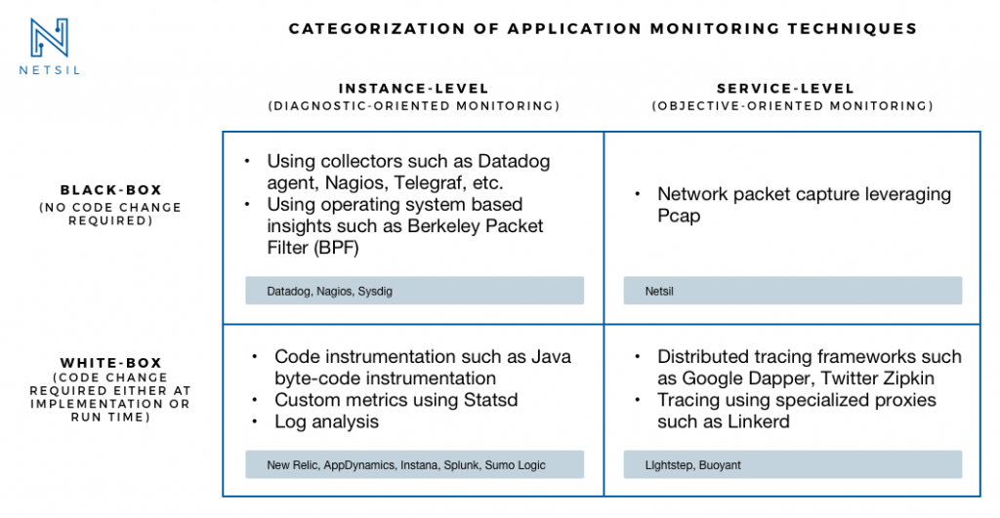

## Availability Table number of 9s

()

## SRE Engagement model

( )

## Black box vs White box monitoring

| Black Box monitoring | White box monitoring |
| --- | --- |
| refers to the monitoring of servers with a focus on areas such as disk space, CPU usage, memory usage, load averages | White box monitoring is the monitoring of applications running on a server.  |
|used by DevOps and Ops teams | Used by Developers |
| XX | We need to know the source code of the involved software |
| XX | Requires a high level of understanding and experience of the affected program |
| Nagios , Datadog , Sysdig | Prometheus , Pandora FMS , Zabbix , NewRelic , AppDynamics|

Both work together - a black box monitoring alert that tells us that our server’s CPU usage is at 100 percent. We go on to investigate this issue and see that MySQL processes are the cause of this alert. If we have white box monitoring in place to also monitor the queries running in MySQL, the amount of connections into MySQL and the amount of time it is taking for queries to run, then we have a lot more information to help diagnose the issue

HTTP return codes:
* Informational responses (100 – 199)
* Successful responses (200 – 299)
* Redirection messages (300 – 399)
    * 301 Moved Permanently
    * 303 See Other
    * 307 Temporary Redirect
    * 308 Permanent Redirect
* Client error responses (400 – 499)
    * 400 Bad Request
    * 401 Unauthorized
    * 402 Payment Required
    * 403 Forbidden
    * 404 Not Found
    * 405 Method Not Allowed
    * 407 Proxy Authentication Required
    * 408 Request Timeout
    * 413 Payload Too Large
    * 428 Precondition Required
    * 429 Too Many Requests
* Server error responses (500 – 599)
    * 500 Internal Server Error
    * 501 Not Implemented
    * 502 Bad Gateway
    * 503 Service Unavailable